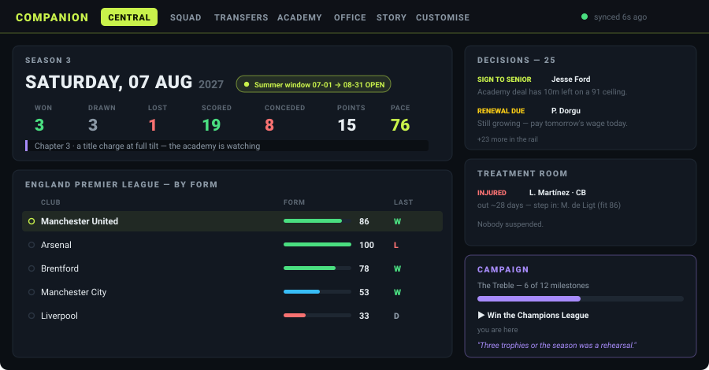
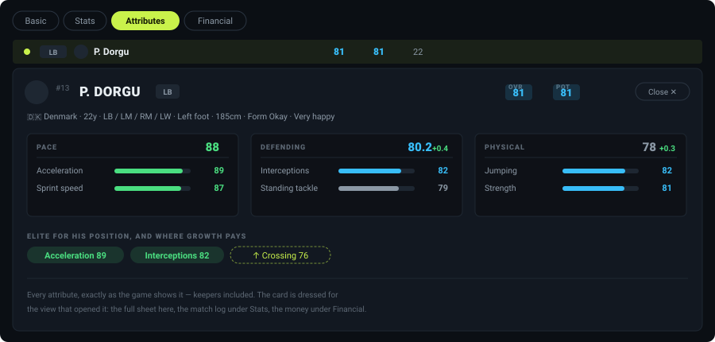
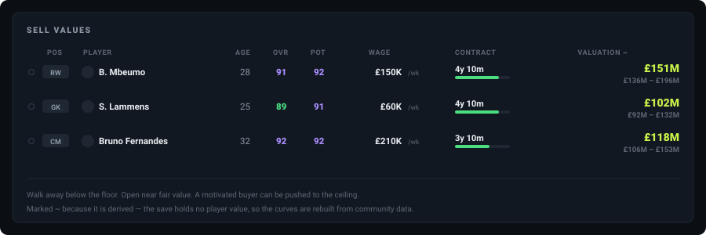
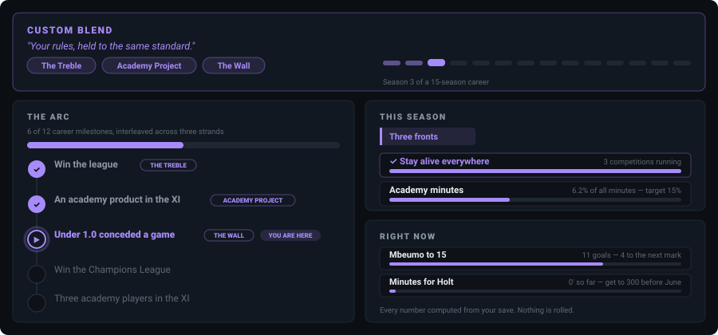
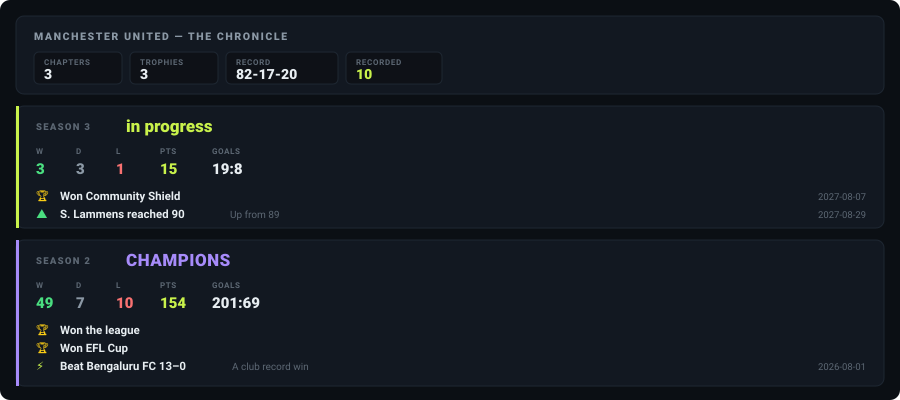

# Companion — the feature guide

**A read-only second screen for EA SPORTS FC 26 Manager Career.**
It watches your save, parses it the moment the game writes it, and shows you the career the game
keeps to itself — on your PC, or on your phone over your own Wi-Fi.

Everything on screen comes out of **your** save file. Nothing is invented. A fact the save does not
hold renders as unknown, and anything derived wears a `~`.

---

## The first screen

Central is the day in front of you: the date, both transfer windows with the open one lit, and the
season's record. Down the side sit the decisions the rules have fired, who is injured and **who
should replace them**, who is moving, and — if you want it — the campaign.

The dot beside the clock is the one thing worth learning: **green** means what you are reading is
current, **amber** that it is ten minutes old, **red** that it is half an hour old and the game has
moved on without you. Companion can only ever be as fresh as your last save.

---

## Every player, four ways

The Squad Hub is one table with four column sets — **Basic**, **Stats**, **Attributes**,
**Financial** — and opening a row unfolds a card *dressed for the view you opened it from*: the full
attribute sheet here, the match-by-match log under Stats, the money page under Financial.

Every attribute, exactly as the game shows them, keepers included. Season change rides beside each
number, and the chips at the bottom mark what he is genuinely elite at for his position — measured
against the 21,000 players in **your** save's world, not a global average.

The academy gets the same four views, so a sixteen-year-old is as readable as your captain.

**Position fit.** Every player is rated in every slot by a model fitted on your own world and
anchored so that a player's rating in his own position matches the game exactly. When it says a
midfielder is an 84 at right-back, that number means something.

---

## What he is worth

The save holds no player value — so Companion rebuilds EA's own valuation curves (overall × age ×
ceiling × position) and gives you a **walk-away floor, a fair value, and the ceiling a motivated
buyer can be pushed to**. Alongside it, where the data exists, sits what your world's own completed
transfers have actually paid for that profile.

The same thinking runs through **Wages**: every player with a recorded wage gets a proposal — two
package shapes (flat, or a lower base with appearance money), a release-clause verdict, and the
longest term the game will accept at his age. When to renew is your call; Companion never hides the
option.

---

## The career as a campaign

Switch on **RPG mode** and the career becomes a story with rules. Nine campaigns — Road to Glory,
The Treble, Invincibles, Century Club, The Wall, Youth Revolution, Academy Project, Moneyball — or a
**custom blend** of any of them, whose ladders interleave so the arc advances on every front at once
instead of finishing one story before starting the next.

Three tiers you can tell apart at a glance:

- **The arc** — career milestones as a stepper: done, *you are here*, still ahead.
- **This season** — missions re-cut with the phase of the season, named in the campaign's own voice.
  August is "Loading the guns" under Century Club and "Buy low" under Moneyball.
- **Right now** — the marks within reach this week.

And it is a **lens, not a tab**: with RPG on, each mission appears in violet at the top of the view
where the work actually happens — title pace on Team Management, minutes on Development, contracts
on Wages. Every number is computed from your save. Nothing is rolled.

---

## The story it remembers

Companion keeps a **story ledger**: trophies, finishes, record scorelines, transfer business,
promotions out of the academy, and players crossing 80, 85 and 90 — each written the first time it
is seen and never rewritten. The Chronicle reads that back as chapters.

That "written once" matters. History keeps its own dates instead of being recomputed from the
present, so a record set two seasons ago stays filed where it happened. Seasons that were already in
your save when you started carry no date, because none is knowable — Companion would rather say
nothing than date last year with today.

---

## The rest of it

| | |
|---|---|
| **Team Management** | A depth chart first — every position, first choice down, one-injury-from-a-hole flagged — then your saved XI against the XI the fit model would pick, on a pitch drawn from your own formation's coordinates. Bench and reserves as real tables. |
| **Synergy** | Who supplies whom and how strongly, from attributes and PlayStyles, as connection cards rather than a spreadsheet — plus the three biggest levers to raise it. |
| **Development** | Everyone with growth left, as runway cards: how far he has come against his ceiling, whether the minutes are arriving, and the attributes where growth buys the most. |
| **Transfers** | Targets your career can actually sign, with fit and synergy measured against your squad and the case for each as reason badges. The game's own shortlist, read straight from the save. A watchlist that freezes numbers and tracks the drift with a verdict that moves every save. |
| **Loans** | Who is out, and the only performance signal the save records. Plus a scorer for a *real* approach: pick the club that called and the offer is scored out of ten on line strength, stretch, league quality and the development profile. |
| **Academy** | Your signed prospects, and separately the prospects a scout has delivered but you have not signed — each with a sign / watch / pass verdict weighed against the academy you already have. Or switch the verdicts off entirely and judge them yourself. |
| **Office** | Board expectations, the career as a timeline, every real manager in the world by the game's own star rating (split men's / women's), finances, and club stats including **ceiling watch** — potential is dynamic in FC 26, and Companion shows you when it moves. |
| **Story** | The Chronicle, the campaign, and a shareable career card built from your save. |

---

## How it behaves

**Dwell, not clicking.** On a desktop, rest the pointer on a control and a bar fills; when it
completes, the control fires. On table rows the dwell zone is the dot at the row's start, so the
rest of the row is safe to rest a pointer on while you read. Clicking always works too. On a phone
there is no hover, so everything is a plain tap.

**One look.** The app wears the game's own language — near-black, volt green — with a violet reserved
entirely for the story layer and a cyan for modes that are not yet available.

**It explains itself once.** Panels state their name and show their numbers; the `i` on a heading
carries the explanation of where those numbers came from, for the moments you want it.

---

## Honesty, which is the point

- `~` marks a derived value. It is shown, and it never drives a recommendation.
- A dash means the save does not hold that fact. Gaps are not filled with guesses.
- Models refuse to extrapolate. A player outside what a model has seen gets *"beyond this market"*,
  not a confident number.
- Features with nothing behind them say so. AI mode is switched **off and marked unavailable**
  rather than shipping a plausible placeholder.
- When the game keeps something Companion cannot read — the live league table is the current
  example — it says exactly that instead of showing an order it cannot stand behind.

---

## Getting it running

Ten minutes, once. See **[install.md](install.md)** — you need Node.js, `npm install`, and a
double-click of `Companion.vbs`. Phone access is one flag and prints its own address.

**Read-only, local-only.** Companion never writes to a save, never touches game memory, never
injects. No accounts, no cloud, no telemetry; the server binds to your machine, and phone access on
your own network is an explicit opt-in.

Then see **[usage.md](usage.md)** for what each screen means once you are in.

---

*Companion is a fan-made tool, not affiliated with, endorsed by, or connected to Electronic Arts.
EA SPORTS FC™ is a trademark of Electronic Arts Inc.*
